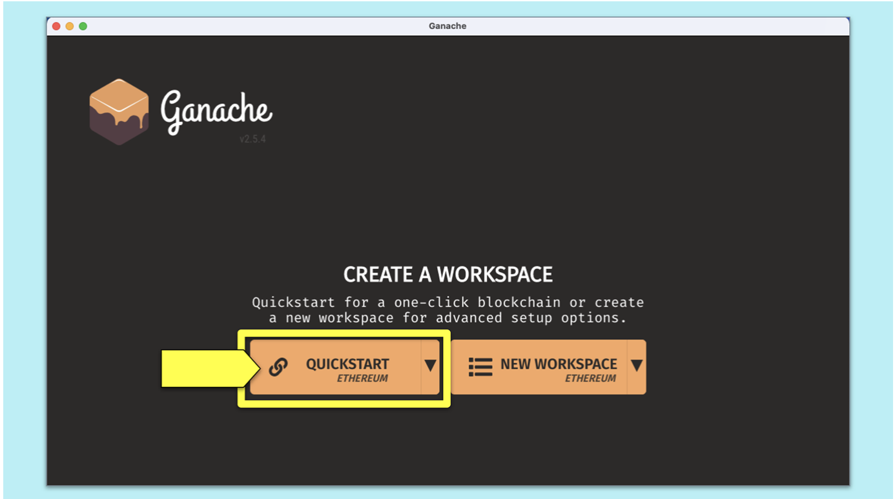
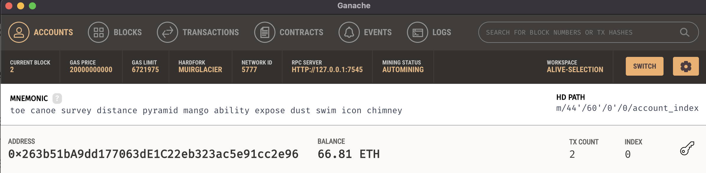
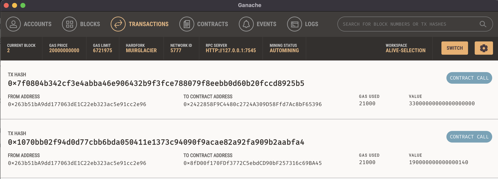
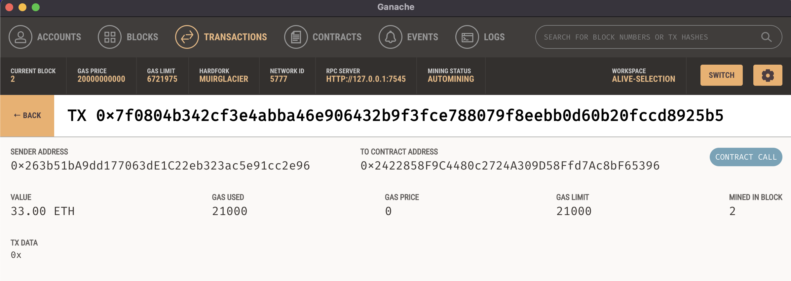
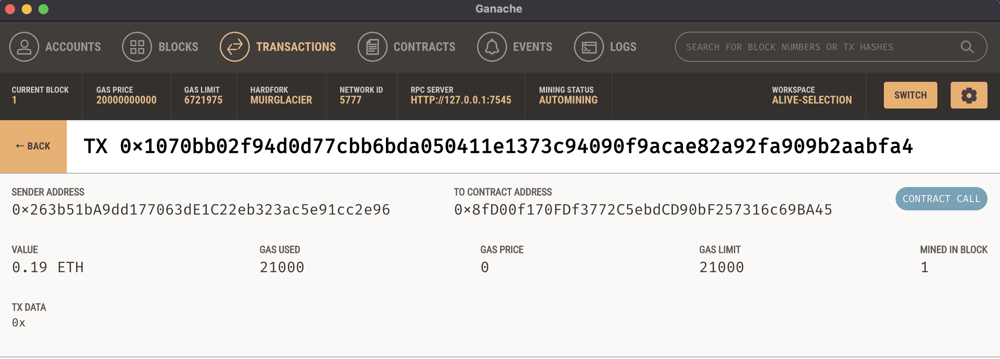

# Fintech-PRO
  Fintech Finder App, Crypto Wallet, Ethereum Blockchain Network 

## Background

 Fintech Finder is an application that its customers can use to find fintech professionals from among a list of candidates, hire them, and pay them. Assuming the role of a developer, I'll be integrating the Ethereum blockchain network into the application in order to enable the customers to instantly pay the fintech professionals whom they hire with cryptocurrency.

To accomplish this, I'll do the following:

* Generate a new Ethereum account instance by using the mnemonic seed phrase provided by Ganache.
* Fetch and display the account balance associated with the Ethereum account address.
* Calculate the total value of an Ethereum transaction, including the gas estimate, that pays a Fintech Finder candidate for their work.
* Digitally sign a transaction that pays a Fintech Finder candidate, and send this transaction to the Ganache blockchain.
* Review the transaction hash code associated with the validated blockchain transaction.

## Technologies
This project runs on python 3.7 and includes the following libraries and dependencies:

* streamlit 
* os
* requests
* dotenv 
* load_dotenv()
* bip44 
* Wallet
* web3 
* Account
* middleware
* web3.gas_strategies.time_based 
* medium_gas_price_strategy


## Installation Guide

To use the application you need to install the following dependencies.

```
pip install streamlit
pip install web3==5.17
pip install eth-tester==0.5.0b3
pip install mnemonic
pip install bip44

```
## Download the Latest Version of Ganache
Follow the instructions on the Ganache download page https://trufflesuite.com/ganache/ to download and install this tool on your local machine.

### Create a Workspace

When you open Ganache, you are presented with two options for creating a workspace: Quickstart Ethereum and New Workspace Ethereum. Click Quickstart Ethereum.




## Usage

To use this application just clone the repository and in the terminal navigate to the project folder, run the Streamlit application by using `streamlit run pychain.py`.

You can now view your Streamlit app in your browser.

On the app you can select a fintech professional from the application interface’s drop-down menu, and then input the amount of time for which you’ll hire the worker. Click the Send Transaction button to sign and send the transaction with your Ethereum account information. To varify the transaction navigate to the Transactions section of Ganache .


## Usage Examples

### Sender's Addresses Balance





### recipient's address balance and history





## Contributers

Manisha Lal

10/25/2022

manisha.lal.2009@gmail.com
___


## License
copyright 2022


